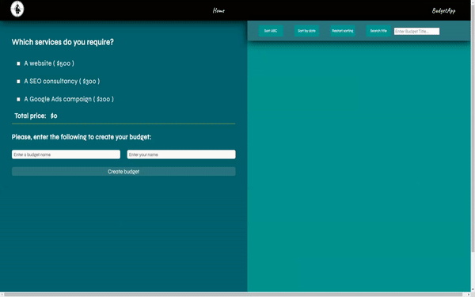
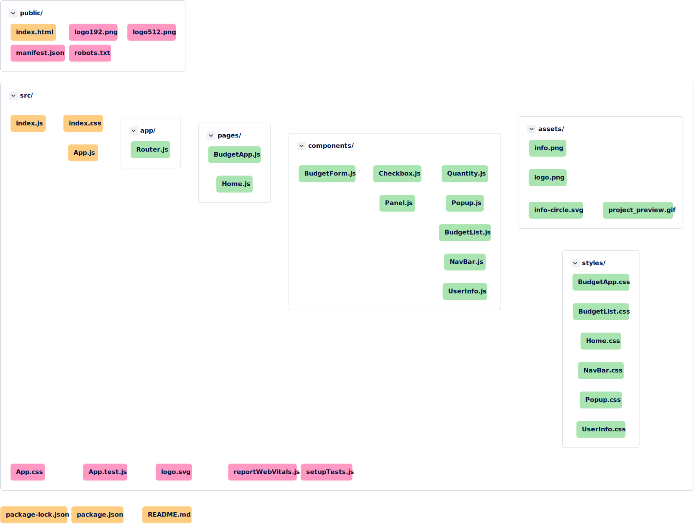

# **Project Preview**

## 

---

## **Project Tree Diagram**

[Click here for an interactive diagram of this project](https://app.codesee.io/maps/8c8ded60-fb80-11ec-804c-0f4dc38e2b97)

## :wrench: **Tech used in this project**

In this project I´m using React JS to develop a web app that will allow the user to create a budget & save it for later use, adding more interactions with the user than in the previous practices (check boxes, inputs, buttons). This web app will have to react and modify the total price depending on the options chosen by the user.
It also allows the user to create multiple budgets & sort them by name, date of creation & to search for an specific budget title.

---

## :mortar_board: **What did I learn from this project**

Through this project I have been able to continue learning the basics of React, create and implement more reusable components, make use of props, work with styled-components, keep practicing with useState, useEffect & how to use conditional rendering to display different screens.
I was able to learn about localStorage since I had to implement it in order to save the budget form data and the budget list that the user can create by saving the budgets. It also gave the oportunity to learn about React routes, as well as the implementation of the useSearchParams hook in order to be able to share the actual URL of the budget the user created.

---

## :memo: **What do I still need to do**

1. Validate fields.

2. Apply styled-components.

3. Refactor the code better.

4. Make it responsive.

---

## :seedling: **Getting Started with this project**

This project was bootstrapped with [Create React App](https://github.com/facebook/create-react-app).

Please, visit the following link for instructions on how to start it: [create-react-app](https://create-react-app.dev/)

---

## :bookmark_tabs: **Instructions**

---
